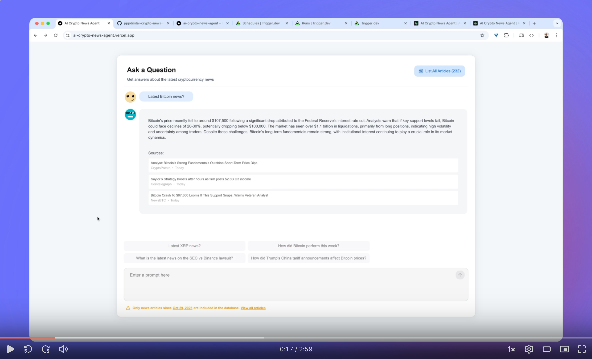

## Video Overview (3 min)

[https://www.loom.com/share/34816662e7de41d5a4e6794c22354c80](https://www.loom.com/share/34816662e7de41d5a4e6794c22354c80)

[](https://www.loom.com/share/34816662e7de41d5a4e6794c22354c80)

# AI Crypto News Agent

**A Next.js application that answers crypto questions using fresh, grounded news with strict citations.**

[](https://nextjs.org/)
[](https://www.typescriptlang.org/)
[](https://supabase.com/)
[](https://github.com/pgvector/pgvector)
[](https://openai.com/)

---

## What It Does

Ingests crypto news from **6 major publishers** → Indexes with **hybrid vector + full-text search** → Retrieves & re-ranks relevant passages → Generates **cited, grounded answers** using LLMs.

**Try it:** Ask _"What happened with the Solana ETF this week?"_ and get an accurate, source-backed answer with citations.

---

## 📰 News Sources

| Source              | Homepage                                         |
| ------------------- | ------------------------------------------------ |
| **Cointelegraph**   | [cointelegraph.com](https://cointelegraph.com)   |
| **CryptoPotato**    | [cryptopotato.com](https://cryptopotato.com)     |
| **NewsBTC**         | [newsbtc.com](https://www.newsbtc.com)           |
| **99Bitcoins**      | [99bitcoins.com](https://99bitcoins.com)         |
| **Crypto Briefing** | [cryptobriefing.com](https://cryptobriefing.com) |
| **ZyCrypto**        | [zycrypto.com](https://zycrypto.com)             |

📖 **Details:** [docs/crypto-news-sources.md](docs/crypto-news-sources.md)

---

## System Architecture

### Ingestion Pipeline (Runs every 15 Minutes)

**RSS Feeds** → **Firecrawl Extraction** → **Normalization & Data Cleaning** → **Chunk & Embed** → **Supabase Postgres**

- Incremental ingestion via `last_scraped_at` tracking
- Automated via Trigger.dev scheduled task

📖 **Details:** [docs/scheduled-crawling.md](docs/scheduled-crawling.md) | [docs/ingestion-pipeline.md](docs/ingestion-pipeline.md) | [docs/crawler.md](docs/crawler.md)

### 🧠 RAG Pipeline (Query Path)

The core of the system — a LangGraph-orchestrated pipeline optimized for accuracy and speed:

```
User Query
    ↓
┌──────────────────────────────────────────────┐
│   LangGraph RAG Workflow (Retrieval Only)    │
├──────────────────────────────────────────────┤
│ 1. Temporal Detection                        │
│    └─→ Extract time context (days)           │
│                                              │
│ 2. Query Embedding                           │
│    └─→ Generate 1536-dim vector              │
│                                              │
│ 3. Hybrid Search                             │
│    ├─→ Vector similarity (70%)               │
│    ├─→ Full-text search (30%)                │
│    ├─→ Recency decay (10% per week)          │
│    └─→ Return top 40 candidates              │
│                                              │
│ 4. Conditional Routing (LangGraph)           │
│    ├─→ < 10 candidates: Skip rerank          │
│    └─→ ≥ 10 candidates: LLM rerank           │
│                                              │
│ 5. Re-ranking (Conditional)                  │
│    ├─→ LLM scores each chunk (1-10)          │
│    └─→ Return top 8 chunks                   │
└──────────────────────────────────────────────┘
    ↓
  rerankedChunks
    ↓
┌──────────────────────────────────────────────┐
│     Route Handler (app/ask/route.ts)         │
├──────────────────────────────────────────────┤
│ 6. Answer Generation (streaming)             │
│    ├─→ Prompt LLM with context               │
│    ├─→ Stream tokens to UI                   │
│    └─→ Include citation markers              │
│                                              │
│ 7. Citation Enrichment                       │
│    ├─→ Extract article IDs                   │
│    ├─→ Fetch metadata from DB                │
│    └─→ Return enriched citations             │
└──────────────────────────────────────────────┘
    ↓
Streaming Response + Citations
```

**Key Choices:**

- **LangGraph orchestration**: StateGraph with conditional routing skips re-ranking when < 10 candidates (cost/latency optimization)
- **Temporal detection**: Keyword-based recency filtering (N days) for time-sensitive queries
- **HNSW indexing**: 97-99% recall with `m=16, ef_construction=64`
- **Weighted scoring**: 70% semantic + 30% keyword prevents drift to generic finance news
- **Score normalization**: Both vector and FTS normalized to 0-1 before combining
- **Recency decay**: Gentle 10% decay per week favors fresh content
- **LLM re-ranking**: `gpt-4o-mini` scores 40→8 for precision (2-5s overhead, conditionally skipped; This should be replaced by a local cross-encoder)
- **Strict grounding**: System prompt enforces citation-only responses, returns "No recent news" instead of hallucinating
- **Citation tracking**: Extracts article IDs from LLM, enriches with metadata, deduplicates by URL

📖 **Details:** [docs/rag-pipeline.md](docs/rag-pipeline.md)

---

## 🔑 Key Technical Choices

| Technology                                  | Why                                                                                                                 |
| ------------------------------------------- | ------------------------------------------------------------------------------------------------------------------- |
| **pgvector + Postgres FTS**                 | Hybrid search: semantic understanding + exact keyword matching for crypto jargon                                    |
| **OpenAI `text-embedding-3-large` @ 1536d** | 95% quality retention, fits pgvector 0.8.0 HNSW limits, handles crypto jargon; Could be replaced by a smaller model |
| **HNSW index (m=16, ef=64)**                | 97-99% recall with fast ANN search, superior to IVFFlat                                                             |
| **LangGraph conditional routing**           | Skips LLM re-ranking when < 10 candidates (cost/latency optimization)                                               |
| **Vercel AI SDK**                           | Streaming tokens for responsive UI                                                                                  |
| **Trigger.dev**                             | Reliable 15-minute scheduled ingestion with retries                                                                 |

---

## 📊 Database Schema

```sql
sources (id, name, homepage_url, rss_url, last_scraped_at)
articles (id, source_id, url, url_hash, title, published_at, text_summary, tsvector)
article_chunks (id, article_id, chunk_index, content, embedding[1536], token_count)
```

**Indexes:**

- HNSW (cosine) on `article_chunks.embedding`
- GIN on `articles.tsvector` (full-text search)
- B-tree on `articles.published_at` (recency filtering)

---

## 🚀 Features

### Chat Interface (root page)

- Single-turn Q&A with streaming responses
- Strict citations: every claim backed by article ID, date, and source
- Returns **"No recent news"** instead of hallucinating
- Citation cards with title, source, date, and URL

### News List (`/news`)

- Browse all ingested articles

---

## 🛠️ Tech Stack

| Layer                  | Technology                                                   |
| ---------------------- | ------------------------------------------------------------ |
| **Framework**          | Next.js 16 (App Router, Server Actions)                      |
| **Language**           | TypeScript (strict mode)                                     |
| **Database**           | Supabase Postgres + pgvector 0.8.0                           |
| **AI/LLM**             | OpenAI (embeddings + generation), LangChain, LangGraph 1.0.1 |
| **UI**                 | HeroUI (NextUI), Tailwind CSS, Lucide React                  |
| **Background Jobs**    | Trigger.dev (15-min scheduled crawling)                      |
| **Content Extraction** | Firecrawl                                                    |

---

## 📁 Documentation

- **[Crawler](docs/crawler.md)** - Ingestion system details
- **[Ingestion Pipeline](docs/ingestion-pipeline.md)** - Mock vs. manual vs. scheduled ingestion
- **[RAG Pipeline](docs/rag-pipeline.md)** - Retrieval, re-ranking, and answer generation
- **[Scheduled Crawling](docs/scheduled-crawling.md)** - Trigger.dev automation
- **[Trigger Deployment](docs/trigger-deployment.md)** - Production deployment guide
- **[Crypto News Sources](docs/crypto-news-sources.md)** - RSS feed details
- **[Testing](docs/testing.md)** - Testing guide with Vitest

---

## Other notes

**Local + production** deployment ready

---

## 🔐 Security

- RLS enabled on Postgres (public access disabled)
- Server-only API keys (Supabase service role, OpenAI, Firecrawl)
- No client-side secret exposure

---

## 🚀 Local Setup

### Prerequisites

- **Node.js 22+** - Install via [NVM](https://github.com/nvm-sh/nvm#installing-and-updating) (recommended)
- **Docker** - Required for local Supabase ([Install Docker](https://docs.docker.com/get-docker/))
- **OpenAI API Key** - [Get one here](https://platform.openai.com/api-keys)
- **Firecrawl API Key** - [Sign up](https://www.firecrawl.dev/) or [self-host](https://github.com/mendableai/firecrawl)
- **Trigger.dev Account** (optional for scheduled crawling) - [Sign up](https://trigger.dev/) or [self-host](https://trigger.dev/docs/open-source-self-hosting)

### Installation

```bash
# Clone the repository
git clone <repo-url>
cd ai-crypto-news-agent

# Install Node.js 22 (if using NVM)
nvm install 22
nvm use 22

# Install dependencies
npm install

# Start local Supabase (requires Docker)
npm run supabase:start
```

After Supabase starts, it will output:

- `API URL` → Use as `SUPABASE_URL`
- `Secret API key` → Use as `SUPABASE_API_KEY`

### Environment Variables

Create a `.env.local` file in the project root:

```bash
# Supabase (from `supabase start` output)
SUPABASE_URL=http://127.0.0.1:54321
SUPABASE_API_KEY=<secret_api_key_from_supabase_start>

# OpenAI
OPENAI_API_KEY=<your_openai_api_key>

# Firecrawl
FIRECRAWL_API_KEY=<your_firecrawl_api_key>

# Environment
NODE_ENV=development
```

### Database Setup

Manually run SQL code for migrations through the Supabase UI after you start Supabase. Migrations are in `supabase/migrations/`.

To regenerate TypeScript types after schema changes:

```bash
npm run supabase:gen-types:dev
```

### Running the Application

```bash
# Start Next.js dev server
npm run dev
```

Visit [http://localhost:3000](http://localhost:3000) to use the chat interface.

### Ingesting News Articles

**Option 1: Manual crawl** (one-time)

```bash
npx tsx scripts/crawl-news.ts
```

**Option 2: Scheduled crawling** (every 15 minutes via Trigger.dev)

```bash
# Start Trigger.dev dev server
npm run trigger:dev
```

See [docs/scheduled-crawling.md](docs/scheduled-crawling.md) and [Trigger.dev documentation](https://trigger.dev/docs) for production deployment.

### Running Tests

```bash
# Run tests in watch mode
npm test

# Run tests once (CI mode)
npm run test:run

# Run tests with UI
npm run test:ui

# Run tests with coverage
npm run test:coverage
```

See [docs/testing.md](docs/testing.md) for detailed testing guide.

### Stopping Services

```bash
# Stop Supabase
npm run supabase:stop

# Stop Next.js (Ctrl+C in the terminal)
# Stop Trigger.dev (Ctrl+C in the terminal)
```

---

## 📝 Environment Variables Reference

| Variable            | Required | Description                                        |
| ------------------- | -------- | -------------------------------------------------- |
| `SUPABASE_URL`      | ✅       | Supabase API URL (local: `http://127.0.0.1:54321`) |
| `SUPABASE_API_KEY`  | ✅       | Supabase service role key (bypasses RLS)           |
| `OPENAI_API_KEY`    | ✅       | OpenAI API key for embeddings and LLM              |
| `FIRECRAWL_API_KEY` | ✅       | Firecrawl API key for content extraction           |
| `NODE_ENV`          | ⚠️       | `development` or `production`                      |
